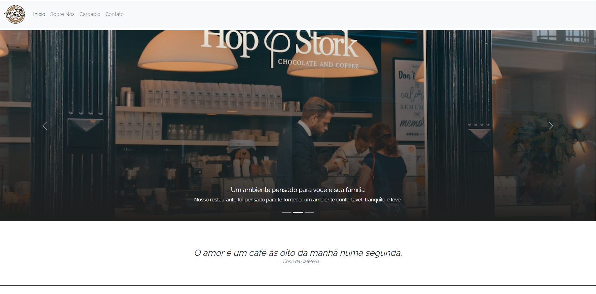
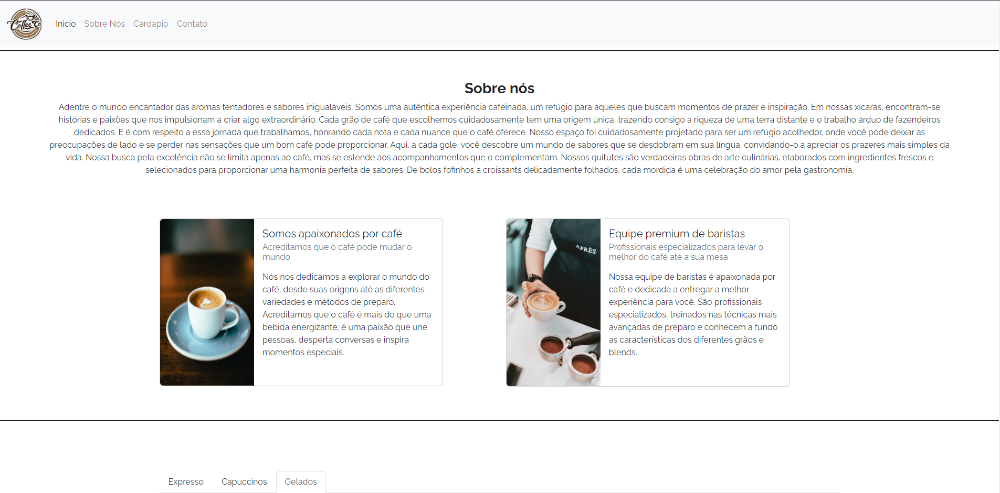
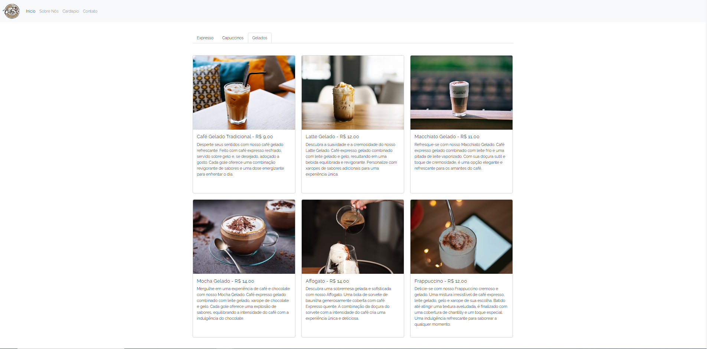
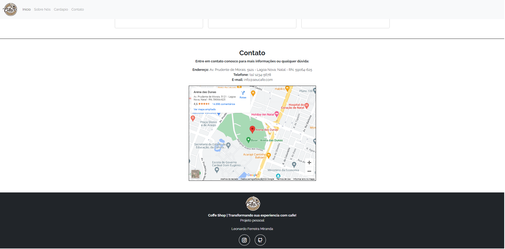

<h1 align="center">Cafezim virtual</h1>

  # Loja de Café Virtual

Bem-vindo à minha loja de café virtual! Este projeto foi desenvolvido usando o framework Bootstrap para criar uma interface moderna e responsiva.

## Recursos Implementados

- Carousel: Adicionei um carousel na página inicial para exibir imagens e destaques dos produtos.

- Cards: Utilizei cards para exibir informações detalhadas sobre os diferentes tipos de café disponíveis na loja.

- Localização: Implementei um recurso de localização que permite aos clientes encontrar a loja física mais próxima.

